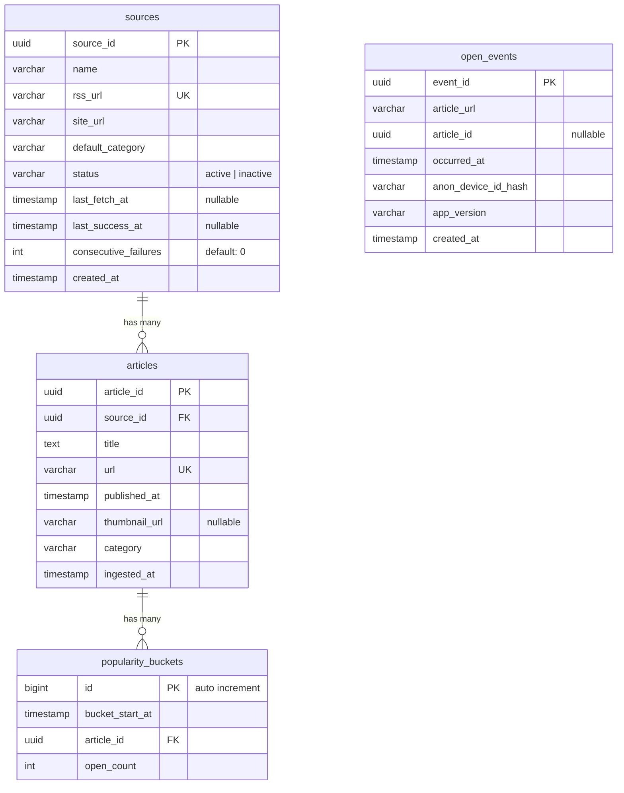

# Database Schema

## ER Diagram

## Tables

### sources

RSS feed sources.

| Column | Type | Constraints |
|--------|------|-------------|
| source_id | uuid | PK |
| name | varchar(255) | |
| rss_url | varchar(2048) | UNIQUE |
| site_url | varchar(2048) | |
| default_category | varchar(100) | |
| status | varchar(20) | default: `active` |
| last_fetch_at | timestamp | nullable |
| last_success_at | timestamp | nullable |
| consecutive_failures | int | default: `0` |
| created_at | timestamp | |

### articles

Articles fetched from RSS sources.

| Column | Type | Constraints |
|--------|------|-------------|
| article_id | uuid | PK |
| source_id | uuid | FK -> sources.source_id |
| title | text | |
| url | varchar(2048) | UNIQUE |
| published_at | timestamp | |
| thumbnail_url | varchar(2048) | nullable |
| category | varchar(100) | |
| ingested_at | timestamp | |

**Indexes:**
- `(published_at, article_id)` -- cursor pagination
- `(category, published_at, article_id)` -- category feed

### open_events

Article open events sent from the iOS app.

| Column | Type | Constraints |
|--------|------|-------------|
| event_id | uuid | PK |
| article_url | varchar(2048) | |
| article_id | uuid | nullable |
| occurred_at | timestamp | |
| anon_device_id_hash | varchar(128) | |
| app_version | varchar(50) | |
| created_at | timestamp | |

**Indexes:**
- `(occurred_at)` -- aggregation query

### popularity_buckets

Aggregated open counts per time bucket, used for the popular feed.

| Column | Type | Constraints |
|--------|------|-------------|
| id | bigint | PK, auto increment |
| bucket_start_at | timestamp | |
| article_id | uuid | FK -> articles.article_id |
| open_count | int | |

**Indexes:**
- `(bucket_start_at, article_id)` -- UNIQUE
- `(bucket_start_at, open_count)` -- popular feed query
